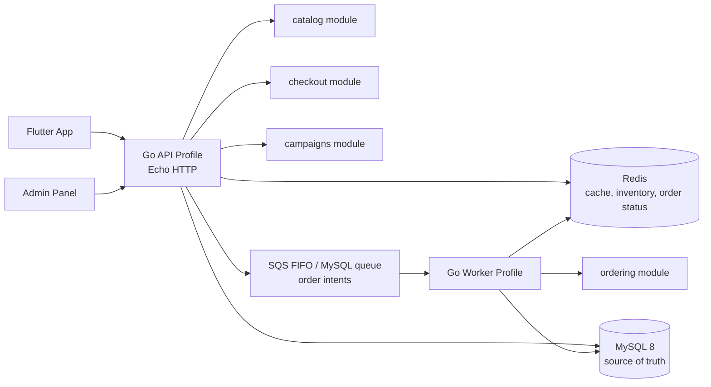

# Backend Architecture

This document is the implementation contract for the Loob assessment backend. It replaces the earlier cloud-scale narrative with a backend shape that can be implemented incrementally in this repository while still demonstrating how the system scales for flash-sale ordering.

## Goals

- Support the four assessment modules: menu browsing, ordering, vouchers/campaigns, and multi-country experience.
- Keep one Go deployable codebase, but separate business domains clearly enough that API and worker runtimes can scale independently.
- Protect checkout from traffic spikes by accepting order intents quickly and processing database writes asynchronously.
- Keep mobile responses lean by resolving country, language, price, and tax rules in the backend.
- Make production failure modes observable: every checkout should be traceable from HTTP request to queue message to worker result.

## Assessment Scope Mapping

| Module | Requirement | Current architecture decision |
| --- | --- | --- |
| Menu | Category browsing, localized names/descriptions, country pricing/currency, customizations, dietary tags, availability by country or outlet. | `catalog` exposes categories-first reads (`/catalog/categories`, `/catalog/categories/:category_id/items`). MySQL stores translation JSON, zone pricing, dietary tags, customization groups/options, and outlet item status; the API resolves one lean country/language payload for the mobile app. |
| Ordering | Cart management, checkout for dine-in/takeaway/delivery, status/history, and peak-load handling. | `cart` owns persisted cart lines; `checkout` validates cart, customization, voucher, payment method, idempotency, charges, and tax; the assignment runtime creates a `PAYMENT_PENDING` intent plus pending payment transaction atomically, then `payments` moves successful mock-gateway callbacks to `READY_TO_COLLECT`. The cloud target can add SQS FIFO between payment capture and kitchen/order processing when burst buffering is required. |
| Vouchers | Listing/redemption, percentage/fixed discounts, minimum spend, per-user limits, expiry, country availability, and stacking decision. | `vouchers` lists active country-scoped wallet vouchers. `checkout` supports stacked vouchers through `voucher_codes`, validates discount type, minimum spend, cap, brand/store/category/item/payment scope, max redemption count, max per-user count, expiry, promo-item rules, stacking group, priority, exclusivity, and compatible groups. Captured payment marks each applied voucher as used and increments redemption counters. |
| Multi-country | Country onboarding, localized content, region flags, tax rules, timezone handling. | `contextx` resolves `X-Country-Code` and `Accept-Language`; countries carry currency, default language, tax rate, and timezone; feature flags and checkout charge definitions are country/zone/brand scoped. Checkout/status/history require an explicit country header. All monetary values stay integer minor units. |

## Non-Goals For The Assignment

- Full microservices split.
- Real payment gateway integration.
- Terraform/CDK implementation.
- DynamoDB home-feed implementation unless the core assignment is already complete.
- Full admin CMS implementation beyond the APIs needed to prove the data model.

## Architecture Pattern

Use a Go modular monolith.

The repository remains one backend module and one deployable artifact, but domain logic is organized into bounded packages. Runtime behavior is selected by profile:

- `api`: starts Echo HTTP routes for mobile/admin clients.
- `worker`: starts background consumers for order processing.

This gives the architecture benefits needed for the assignment without taking on distributed-service complexity.



## Package Boundaries

Target backend structure:

```text
backend/
  cmd/
    api/main.go
    worker/main.go
  internal/
    platform/
      config/
      database/
      httpserver/
      observability/
      queue/
      redis/
      sqlc/
    contextx/
    catalog/
      domain/
      repository/
      service/
      transport/http/
    checkout/
      domain/
      service/
      transport/http/
    ordering/
      domain/
      worker/
      repository/
    campaigns/
      domain/
      service/
      transport/http/
    users/
      auth/
      domain/
    models/
```

Rules:

- `cmd/*` only wires dependencies and starts a runtime.
- `transport/http` packages decode requests and encode responses only.
- `service` packages own business rules and orchestration.
- `repository` packages own database access.
- Domain packages must not import Echo, `database/sql`, generated SQL code, Redis, or AWS SDK types.
- Platform packages must not contain Loob business rules.

## Request Context Contract

Every API request gets a normalized context:

- `trace_id`: from `X-Trace-Id` or generated by middleware.
- `country_code`: from `X-Country-Code`, validated against active countries.
- `language`: from `Accept-Language`, normalized to the country-supported language list with fallback to `en-US`.
- `user_id`: from Firebase token when authentication is required.

Handlers must not read raw headers repeatedly. They should consume a typed request context from middleware.

## Core Flows

### Catalog Read Flow

1. Client requests menu with `X-Country-Code` and `Accept-Language`.
2. API normalizes request context.
3. Catalog service checks Redis using deterministic keys:
   - `menu:{country}:{language}:brand:{brand_id}`
   - `menu:{country}:{language}:store:{store_id}`
4. On cache miss, repository reads MySQL source data.
5. Service resolves translations, zone pricing, tax display, and availability.
6. API returns a lean mobile payload with only the selected language.

### Checkout And Payment Flow

1. Client submits cart, store, fulfillment type, optional `voucher_codes`, and idempotency key.
2. Checkout service authenticates user and validates country/store/brand availability.
3. Service performs fast checks:
   - cart shape and item availability
   - voucher eligibility
   - idempotency key reuse
4. Service resolves payment method, charges, tax, and total.
5. Service creates an `OrderIntent` plus pending `payment_transactions` row in one transaction.
6. API returns `202 Accepted` with `PAYMENT_PENDING`, `order_tracking_id`, `status_url`, and payment transaction details.
7. The mock gateway callback captures, fails, or cancels the payment. Successful capture moves the order to `READY_TO_COLLECT`, marks applied vouchers as used, applies wallet spend or top-up effects, and awards loyalty points.

For this assessment, payment-first checkout keeps the runtime executable without AWS credentials. A production flash-sale path can add a queue adapter after payment capture; the API must not claim kitchen processing unless the durable queue write succeeds.

### Order Worker Flow

1. Worker claims queued order intents in batches.
2. Worker validates intent status and country scope.
3. Worker promotes each intent from `QUEUED` to `PROCESSING` and then `COMPLETED`.
4. Worker keeps immutable cart, price, voucher, tax, and charge snapshots on the intent row for status/history reads.
5. Failed local processing marks the intent `FAILED`; the SQS cloud adapter should instead let transient failures retry before DLQ.

Worker processing should be idempotent. Retrying the same message must not create duplicate orders.

## Data Ownership

- `catalog`: countries, brands, zones, stores, categories, menu items, customizations, pricing.
- `checkout`: cart validation, voucher eligibility, tax calculation, idempotency, order intent creation.
- `ordering`: durable orders, order items, order status transitions, worker persistence.
- `campaigns`: banners, campaign quotas, mini-game campaign metadata, daily check-in rewards.
- `users`: Firebase UID mapping, country/language preferences, authorization helpers.

Shared tables can exist in MySQL, but business writes should go through the owning module.

## Storage And Caching

### MySQL

MySQL 8 is the source of truth for relational data:

- menu catalog and pricing
- stores and zones
- vouchers
- orders and order items
- user profile references

Use integer currency values in the smallest unit. Use JSON columns for translations and immutable snapshots, not for core relational joins.

Persistence should use raw SQL with a lightweight typed layer:

- `database/sql` owns connection pooling and transactions.
- `sqlc` is the preferred query layer once queries become non-trivial.
- SQL files live near the owning module or under `backend/sql/queries`.
- Migrations are handwritten SQL under `backend/sql/migrations`.
- GORM is intentionally avoided so checkout, order persistence, idempotency, and country-partitioned queries stay explicit.

For narrow prototypes, a repository may use `database/sql` directly. For production-facing assignment flows, prefer `sqlc` so query inputs and result structs are generated from real SQL.

### Redis

Redis is used for:

- localized menu payload cache
- feature flag and tax-rule cache
- hot campaign inventory and voucher counters
- checkout idempotency guard
- temporary order processing status

Redis is not the source of truth for completed orders.

### SQS FIFO

SQS FIFO is the optional cloud peak-load adapter for paid order processing:

- `MessageGroupId`: country or store id, depending on desired ordering scope.
- `MessageDeduplicationId`: tracking id or payment transaction id.
- message body includes schema version, trace id, country, user, store, cart snapshot, voucher snapshot, totals, and payment transaction id.

The current local implementation uses MySQL `order_intents` as the executable order-state store so the assessment can run without AWS credentials. The adapter boundary remains: a future worker must process by country-scoped tracking id and keep retries idempotent.

## API Surface

Initial implementation endpoints:

- `GET /health`
- `GET /api/v1/catalog/categories`
- `GET /api/v1/catalog/categories/:category_id/items`
- `POST /api/v1/orders/checkout`
- `GET /api/v1/orders/:tracking_id/status`
- `GET /api/v1/campaigns/home`
- `GET /api/v1/vouchers/wallet`

Admin endpoints can be added later under `/api/v1/admin/*` once the mobile-critical flows are stable.

## Observability Contract

Minimum implementation:

- structured JSON logs
- trace id middleware
- request logging with country, route, status, latency, and trace id
- checkout logs for accepted/rejected order intents
- worker logs for message received, order persisted, retryable failure, permanent failure
- `/metrics` endpoint when Prometheus dependency is added

No checkout or worker error should be logged without `trace_id`, `country_code`, and either `tracking_id` or `message_id`.

## Failure Modes

| Failure | Expected Behavior |
| --- | --- |
| Missing country header | Default to `MY` only for public browsing; require explicit country for checkout. |
| Unsupported language | Fallback to country default language and include resolved language in response. |
| Redis down during catalog read | Fall back to MySQL and log degraded cache. |
| Redis down during flash-sale checkout | Fail closed for quota-protected campaigns; allow normal checkout only if DB-safe validation exists. |
| Payment callback duplicated | Ignore duplicated gateway event effects and return the current transaction state. |
| SQS send fails in future queued flow | Return retryable error; do not claim kitchen/order processing. |
| Worker crashes mid-message | SQS visibility timeout makes message retry. |
| Duplicate checkout submit | Return the existing tracking id for the idempotency key. |
| Poison message | Retry up to queue policy, then move to DLQ. |

## Implementation Phases

### Phase 1: Backend Foundation

- Create `cmd/api` and `cmd/worker`.
- Add typed config loading.
- Add request context middleware.
- Move current route setup out of `main.go`.
- Add structured logger.
- Replace ORM-style database access with `database/sql` and prepare `sqlc` query generation.
- Keep MySQL local via Docker Compose.

### Phase 2: Catalog

- Implement database schema/migrations for countries, brands, zones, stores, categories, items, pricing, customizations.
- Seed minimal MY data for Tealive and Baskbear.
- Implement localized menu response.
- Add Redis cache interface, with in-memory/no-op fallback for local development if Redis is unavailable.

### Phase 3: Checkout API

- Define checkout request/response DTOs.
- Add validation, tax calculation, voucher lookup, and idempotency.
- Create order intent plus pending payment atomically.
- Use mock gateway callbacks to transition paid orders.
- Add order status polling endpoint.

### Phase 4: Ordering Worker

- Add local MySQL worker only for post-payment processing flows that need background work.
- Add SQS consumer adapter for cloud burst handling when the assignment runtime evolves beyond direct `READY_TO_COLLECT` callbacks.
- Persist completed order summaries and order items transactionally when the order history model needs to evolve beyond `order_intents`.
- Update Redis order status when the cache layer is introduced.
- Add retry/DLQ-aware logging for the SQS adapter.

### Phase 5: Campaigns And Admin

- Add campaign home payload.
- Add voucher wallet.
- Add admin write APIs only where needed to demonstrate CMS/back-office architecture.

## Architecture Quality Gates

Before implementing a new domain feature:

- The domain package owns its business terms.
- Handler logic stays thin.
- External systems are behind interfaces.
- Database behavior is expressed in reviewed SQL, not ORM-generated queries.
- Checkout paths are idempotent.
- Country and language are resolved once per request.
- Logs include trace id.
- Tests cover service-level business behavior before route tests.
