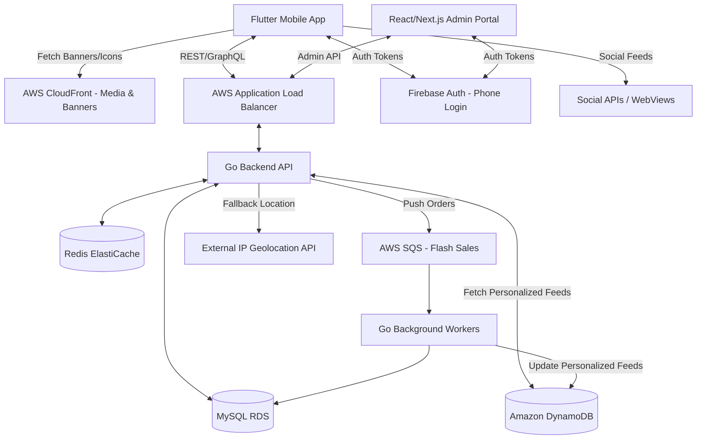

# System Design & Architecture

## 1. High-Level Architecture Overview

The system utilizes AWS cloud services, supplemented by external geolocation and content delivery strategies.

## 2. Component Details

### 2.1 Frontend (Flutter)
- **State Management & Theming:** Riverpod. Dynamic `ThemeData` instantly swaps primary colors/fonts.
- **Dynamic App Icons & Splash:** Utilizing packages like `flutter_dynamic_icon` to programmatically change the home screen icon and native splash screen based on user preference (Tealive vs. Baskbear).
- **Responsive Typography:** UI components utilize `Flexible`, `Expanded`, and dynamic height constraints (`IntrinsicHeight`) to prevent text overflow issues common with verbose languages (Thai, Vietnamese) or larger character heights (Chinese).
- **Engagement Modules:** 
  - `webview_flutter` for dynamic gamification/campaign landing pages.
  - `flutter_social_embed` to render Instagram/TikTok feeds inside the app seamlessly.

### 2.2 Backend (Go Modular Monolith)
- **Runtime Profiles:** The same Go codebase runs as an `api` profile for Echo HTTP routes and a `worker` profile for asynchronous order processing.
- **Smart Region Detection:** If the client payload lacks GPS coordinates, API middleware can read the `x-forwarded-for` IP address and query a fast GeoIP service or internal IP-to-country database to determine the user's region and serve localized content.
- **Banner Delivery System:** The campaigns module serves dynamic campaign payloads such as image URLs, deep links, active schedules, and targeting criteria.
- **Async Checkout:** The checkout module accepts validated order intents into SQS FIFO, while the ordering worker owns durable order writes.

### 2.3 Database (MySQL RDS & DynamoDB)
**MySQL RDS (Relational Core):**
- `Country`: id, code (MY, TH), currency_code, tax_rate, timezone, languages (JSON/Array of language codes).
- `Brand`: id, name, theme_config_json.
- `Store`, `Category`, `MenuItem`, `Order`, `OrderItem`, `Voucher`.
- **`BannerCampaign`**: id, brand_id, country_id, image_url, deep_link, start_date, end_date.
- **`UserLoyalty`**: user_id, points_balance, current_tier.

**DynamoDB (NoSQL Materialized Views):**
- **`UserHomeFeeds`**: Stores the heavily personalized, pre-computed JSON home feed for each user. (Partition Key: `user_id`). This allows the Flutter app to fetch complex recommendations in milliseconds without executing heavy `JOIN` operations on MySQL.

### 2.4 Caching & State (Redis ElastiCache)
- **Menu & Banners:** Heavily cached for rapid retrieval.
- **Daily Check-ins:** Fast atomic updates for user daily check-in states to prevent race conditions during midnight spikes.
- **Flash Sales Rate Limiting:** Redis used to throttle requests during massive campaigns before pushing valid intents to the SQS queue.

## 3. Addressing Specific Technical Challenges

### 3.1 Peak Load & Flash Sales (10x Load)
1. **Menu via Cache:** All menu browsing hits Redis.
2. **Asynchronous Checkout:** Order requests are validated and pushed to **AWS SQS**.
3. **Queue Processing:** Background workers consume SQS messages at a controlled rate, performing DB writes.

### 3.2 Robust Multi-Language UI
Southeast Asian languages have varying lengths and vertical heights (e.g., Thai tonal marks).
**Solution:** Avoid hardcoded container heights. Use `AutoSizeText` packages where appropriate, allow wrapping, and ensure scrollable layouts (`SingleChildScrollView`) for product descriptions to accommodate varying text lengths across English, Chinese, Thai, and Vietnamese.

### 3.3 Frictionless Onboarding (Location)
Relying solely on GPS causes high drop-off if users deny permissions.
**Solution:** The Flutter app sends the device locale string (e.g., `th_TH`). The Go backend reads the request IP. The combination of Locale + IP accurately determines the default country and language without intrusive permission prompts, falling back to a manual selector if ambiguous.

## 4. Multi-Country Constraints & Operational Management

Scaling across Southeast Asia introduces strict constraints regarding data residency, varying taxation, and operational silos. The system is designed to empower both Business Operations and Cloud/DevOps teams.

### 4.1 System & Data Constraints
- **Data Isolation & Residency (PDPA, PDPC):** While a single global database (e.g., in AWS `ap-southeast-1` Singapore) handles early scaling, the schema enforces a strict `country_id` partition key on all user, order, and transaction tables. If a country (e.g., Indonesia or Vietnam) mandates strict data residency, the architecture allows deploying an isolated RDS instance in that specific AWS region, while the Global Auth (Firebase) manages cross-region token routing.
- **Currency & Precision:** All monetary values are stored in the smallest currency unit (e.g., cents/sen) as integers to prevent floating-point inaccuracies. The `Country` table dictates the display formatting and multiplier.
- **Timezone Management:** 
  - **Database:** All timestamps are strictly UTC.
  - **Backend Logic:** Store opening hours and campaign schedules are evaluated by converting the UTC time to the store's configured `timezone` (e.g., `Asia/Kuala_Lumpur`, `Asia/Bangkok`).
  - **Client:** The Flutter app formats UI times based on the user's local device time or the target store's timezone, depending on context (e.g., receipt vs. store opening hours).
- **Taxation Engines:** Taxes (SST, VAT) are not hardcoded. Each country has a `TaxRule` engine in the backend that calculates exclusive vs. inclusive pricing dynamically based on the active cart's fulfillment location.

### 4.2 Business Operations (Admin/CMS Strategy)
To prevent the engineering team from becoming a bottleneck, a comprehensive **Loob Admin Portal (React/Next.js)** is deployed.
- **Multi-Tenant RBAC (Role-Based Access Control):** 
  - **Global Admins (HQ):** Can view all data, manage global Master Vouchers, configure new countries, and define the supported language list for each region.
  - **Country Managers:** Restricted via their token to only view/edit data where `country_id` matches their scope (e.g., the Thai marketing team can only schedule banners and vouchers for Thailand).
  - **Brand Managers:** Restricted to `brand_id` (e.g., Baskbear operations team).
- **Feature Flag Management:** The CMS controls a "Country Features" toggle board. A Country Manager can enable/disable "Delivery", "Wallet Payments", or "Gamification Webviews" instantly without requiring an app store update.
- **Dynamic Content & Campaign Sandbox:** Marketing teams can upload assets, set schedule times (using their local timezone, which the CMS converts to UTC for storage), and target specific user segments (e.g., "Users in Bangkok who haven't ordered in 30 days").

### 4.3 Cloud & DevOps Operations
- **Infrastructure as Code (IaC):** The entire AWS environment is provisioned using Terraform or AWS CDK. This enables the Cloud Ops team to instantly spin up a new environment (e.g., standing up a completely isolated stack in the AWS Jakarta region) simply by changing a region variable in the deployment script.
- **Observability & Alerting:**
  - **Application Performance Monitoring (APM):** Datadog or AWS X-Ray is integrated into both the Flutter app and Go backend. Traces carry custom tags like `country: MY` and `brand: tealive`, allowing the ops team to filter performance metrics by region.
  - **Business Metrics Alerting:** CloudWatch Alarms are set not just for CPU/Memory, but for business anomalies (e.g., "Order volume in Thailand dropped 50% compared to the same hour last week", indicating a potential regional payment gateway failure).
- **CI/CD Pipeline Separation:**
  - **Frontend:** GitHub Actions compiles the Flutter app, injecting region-agnostic environment variables, and pushes to TestFlight/Google Play Console.
  - **Backend:** Code is built into Docker containers. Deployments use rolling updates (ECS/EKS) to ensure zero downtime. Database migrations are strictly backwards-compatible and run via automated jobs before the new app instances start.
