# Loob Unified App: Database Schema (MySQL 8.0+)

This document provides the foundational, unified MySQL database schema for the Loob Unified App. It represents the complete and combined database structure derived from all migrations (`0001_foundation.sql` through `0017_production_schema_hardening.sql`).

The schema is designed for multi-region scalability, strict isolation, and high performance by leveraging the **JSON Translation Pattern**, **Country Partitioning**, and **Integer Currency** design principles.

---

## Entity-Relationship (ER) Diagram

The following Mermaid diagram visualizes the relationships across all SQL-backed tables in the database schema:

```mermaid
erDiagram
    COUNTRIES ||--o{ ZONES : "has"
    COUNTRIES ||--o{ STORES : "has"
    COUNTRIES ||--o{ USERS : "has"
    COUNTRIES ||--o{ WALLET_ACCOUNTS : "has"
    COUNTRIES ||--o{ WALLET_TRANSACTIONS : "has"
    COUNTRIES ||--o{ LOYALTY_ACCOUNTS : "has"
    COUNTRIES ||--o{ LOYALTY_TIER_CONFIGS : "defines"
    COUNTRIES ||--o{ LOYALTY_CHECKINS : "has"
    COUNTRIES ||--o{ LOYALTY_TRANSACTIONS : "has"
    COUNTRIES ||--o{ VOUCHERS : "has"
    COUNTRIES ||--o{ ORDER_INTENTS : "has"
    COUNTRIES ||--o{ CHECKOUT_CHARGE_DEFINITIONS : "has"
    COUNTRIES ||--o{ PAYMENT_METHODS : "has"
    COUNTRIES ||--o{ PAYMENT_TRANSACTIONS : "has"
    COUNTRIES ||--o{ CAMPAIGNS : "has"

    BRANDS ||--o{ STORES : "has"
    BRANDS ||--o{ CATEGORIES : "has"
    BRANDS ||--o{ MENU_ITEMS : "has"
    BRANDS ||--o{ VOUCHERS : "has"
    BRANDS ||--o{ CHECKOUT_CHARGE_DEFINITIONS : "has"
    BRANDS ||--o{ PAYMENT_METHODS : "has"
    BRANDS ||--o{ CAMPAIGNS : "has"
    BRANDS ||--o{ LOYALTY_TIER_CONFIGS : "overrides"

    ZONES ||--o{ STORES : "contains"
    ZONES ||--o{ MENU_ITEM_PRICING : "defines prices for"
    ZONES ||--o{ VOUCHERS : "restricts"
    ZONES ||--o{ CHECKOUT_CHARGE_DEFINITIONS : "restricts"

    STORES ||--o{ STORE_MENU_ITEM_STATUS : "manages availability"
    STORES ||--o{ ORDER_INTENTS : "fulfills"

    CATEGORIES ||--o{ MENU_ITEMS : "contains"

    MENU_ITEMS ||--o{ MENU_ITEM_PRICING : "priced at"
    MENU_ITEMS ||--o{ CUSTOMIZATION_GROUPS : "configured with"
    MENU_ITEMS ||--o{ CUSTOMIZATION_OPTIONS : "linked from"
    MENU_ITEMS ||--o{ STORE_MENU_ITEM_STATUS : "status tracked"

    CUSTOMIZATION_GROUPS ||--o{ CUSTOMIZATION_OPTIONS : "contains"

    USERS ||--o{ WALLET_ACCOUNTS : "owns"
    USERS ||--o{ WALLET_TRANSACTIONS : "performs"
    USERS ||--o{ LOYALTY_ACCOUNTS : "owns"
    USERS ||--o{ LOYALTY_CHECKINS : "checks in"
    USERS ||--o{ LOYALTY_TRANSACTIONS : "earns/redeems"
    USERS ||--o{ USER_VOUCHERS : "claims"
    USERS ||--o{ VOUCHER_USER_REDEMPTION_COUNTERS : "uses"
    USERS ||--o{ ORDER_INTENTS : "places"
    USERS ||--o{ PAYMENT_TRANSACTIONS : "initiates"

    VOUCHERS ||--o{ USER_VOUCHERS : "issued as"
    VOUCHERS ||--o{ VOUCHER_USER_REDEMPTION_COUNTERS : "counts per user"

    ORDER_INTENTS ||--o{ PAYMENT_TRANSACTIONS : "paid via"
    ORDER_INTENTS ||--o{ ORDER_INTENT_ITEMS : "snapshots"
    ORDER_INTENT_ITEMS ||--o{ ORDER_INTENT_ITEM_OPTIONS : "includes"

    PAYMENT_PROVIDERS ||--o{ PAYMENT_METHODS : "facilitates"
    PAYMENT_TRANSACTIONS ||--o{ PAYMENT_EVENTS : "records"

    CAMPAIGNS ||--o{ CAMPAIGN_TARGETING_RULES : "targets"
```



---

## Key Schema Design Decisions

1. **JSON Translations:** Avoids bloated translation tables by storing all localizable strings (e.g. names, descriptions, addresses) as JSON maps (e.g., `{"en": "Pearl Milk Tea", "ms": "Teh Susu Mutiara"}`) parsed by the BFF.
2. **`country_id` Partitioning:** Ensures strict country-level operational boundaries and enables future database sharding by region.
3. **Integer Currency:** All monetary columns (e.g. balance, prices, adjustments, totals) are stored as integers representing the smallest currency unit (e.g. cents/sen) to eliminate floating-point calculation errors.
4. **Order Snapshot Split:** `order_intents.cart_payload` remains the immutable raw checkout request snapshot, while `order_intent_items` and `order_intent_item_options` provide normalized, queryable line snapshots for analytics, order history, refunds, and reorder flows.
5. **Atomic Redemption Counters:** Voucher global and per-user redemption limits are enforced from counter columns/tables, not by counting historical orders during checkout.
6. **Configurable Loyalty Tiers:** Tier thresholds live in `loyalty_tier_configs` so country or brand-level tier changes do not require enum migrations.

---

## 1. Core Platform & Geography

The geography tables define multi-region bounds, brands, regional zones, and store locations.

```sql
CREATE TABLE countries (
    id VARCHAR(2) PRIMARY KEY, -- e.g., 'MY', 'TH'
    name VARCHAR(50) NOT NULL,
    currency_code VARCHAR(3) NOT NULL, -- e.g., 'MYR', 'THB'
    currency_multiplier INT NOT NULL DEFAULT 100, -- 100 means stored in cents/sen
    timezone VARCHAR(50) NOT NULL,
    tax_rate DECIMAL(5, 4) NOT NULL DEFAULT 0.0000,
    default_language VARCHAR(10) NOT NULL DEFAULT 'en-US',
    is_active BOOLEAN NOT NULL DEFAULT true,
    created_at TIMESTAMP NOT NULL DEFAULT CURRENT_TIMESTAMP,
    updated_at TIMESTAMP NOT NULL DEFAULT CURRENT_TIMESTAMP ON UPDATE CURRENT_TIMESTAMP
);

CREATE TABLE brands (
    id INT AUTO_INCREMENT PRIMARY KEY,
    slug VARCHAR(50) NOT NULL UNIQUE, -- e.g., 'tealive', 'baskbear'
    name VARCHAR(50) NOT NULL,
    theme_config JSON,
    created_at TIMESTAMP NOT NULL DEFAULT CURRENT_TIMESTAMP
);

CREATE TABLE zones (
    id VARCHAR(50) PRIMARY KEY, -- e.g., 'MY_WEST', 'TH_BKK'
    country_id VARCHAR(2) NOT NULL,
    name VARCHAR(100) NOT NULL,
    created_at TIMESTAMP NOT NULL DEFAULT CURRENT_TIMESTAMP,
    CONSTRAINT fk_zones_country FOREIGN KEY (country_id) REFERENCES countries(id)
);

CREATE TABLE stores (
    id INT AUTO_INCREMENT PRIMARY KEY,
    brand_id INT NOT NULL,
    country_id VARCHAR(2) NOT NULL,
    zone_id VARCHAR(50) NOT NULL,
    store_code VARCHAR(20) UNIQUE NOT NULL,
    name_translations JSON NOT NULL, -- JSON translation map
    latitude DECIMAL(10, 8),
    longitude DECIMAL(11, 8),
    address_translations JSON,
    timezone VARCHAR(50) NOT NULL,
    operational_status ENUM('OPEN', 'CLOSED', 'TEMPORARILY_CLOSED', 'COMING_SOON') NOT NULL DEFAULT 'OPEN',
    status_message VARCHAR(255) NULL, -- Reason for custom store status
    is_active BOOLEAN NOT NULL DEFAULT true,
    created_at TIMESTAMP NOT NULL DEFAULT CURRENT_TIMESTAMP,
    updated_at TIMESTAMP NOT NULL DEFAULT CURRENT_TIMESTAMP ON UPDATE CURRENT_TIMESTAMP,
    CONSTRAINT fk_stores_brand FOREIGN KEY (brand_id) REFERENCES brands(id),
    CONSTRAINT fk_stores_country FOREIGN KEY (country_id) REFERENCES countries(id),
    CONSTRAINT fk_stores_zone FOREIGN KEY (zone_id) REFERENCES zones(id)
);
```

Feature flags are intentionally not modeled as SQL tables. Runtime app/config toggles should be resolved from the JSON-based configuration layer so regional app behavior can ship without relational schema changes.

---

## 2. Menu Catalog & Pricing

Maintains the structure of regional categories, sellable items, customizable groups, available adjustments, and local store availability overrides.

```sql
CREATE TABLE categories (
    id INT AUTO_INCREMENT PRIMARY KEY,
    brand_id INT NOT NULL,
    name_translations JSON NOT NULL,
    display_order INT NOT NULL DEFAULT 0,
    is_active BOOLEAN NOT NULL DEFAULT true,
    icon_url VARCHAR(255) NULL, -- URL path for category visual icon
    CONSTRAINT fk_categories_brand FOREIGN KEY (brand_id) REFERENCES brands(id)
);

CREATE TABLE menu_items (
    id INT AUTO_INCREMENT PRIMARY KEY,
    category_id INT NULL, -- Nullable for unlisted sellable addons
    brand_id INT NULL,
    item_type ENUM('MAIN', 'ADDON') NOT NULL DEFAULT 'MAIN',
    is_promo BOOLEAN NOT NULL DEFAULT false, -- Flags items on active campaigns/discount items
    sku_code VARCHAR(50) UNIQUE NOT NULL,
    name_translations JSON NOT NULL,
    desc_translations JSON,
    image_url_sm VARCHAR(255),
    image_url_lg VARCHAR(255),
    dietary_tags JSON, -- e.g., ["halal", "contains_dairy", "vegan"]
    is_active BOOLEAN NOT NULL DEFAULT true,
    deleted_at TIMESTAMP NULL,
    CONSTRAINT fk_menu_items_category FOREIGN KEY (category_id) REFERENCES categories(id),
    CONSTRAINT fk_menu_items_brand FOREIGN KEY (brand_id) REFERENCES brands(id),
    INDEX idx_menu_items_brand_type (brand_id, item_type),
    INDEX idx_menu_items_catalog_list (is_active, deleted_at, item_type, brand_id, category_id)
);
CREATE TABLE menu_item_pricing (
    menu_item_id INT NOT NULL,
    zone_id VARCHAR(50) NOT NULL,
    base_price INT NOT NULL, -- Stored as integer currency (e.g. cents)
    tax_inclusive BOOLEAN NOT NULL DEFAULT true,
    PRIMARY KEY (menu_item_id, zone_id),
    CONSTRAINT fk_menu_item_pricing_item FOREIGN KEY (menu_item_id) REFERENCES menu_items(id),
    CONSTRAINT fk_menu_item_pricing_zone FOREIGN KEY (zone_id) REFERENCES zones(id),
    INDEX idx_mip_zone_item (zone_id, menu_item_id)
);

CREATE TABLE customization_groups (
    id INT AUTO_INCREMENT PRIMARY KEY,
    menu_item_id INT NOT NULL,
    group_code VARCHAR(50) NOT NULL DEFAULT '', -- Stable reference key: size, sugar, ice, addons
    name_translations JSON NOT NULL,
    selection_type ENUM('SINGLE_SELECT', 'MULTI_SELECT') NOT NULL,
    min_selections INT NOT NULL DEFAULT 0,
    is_required BOOLEAN NOT NULL DEFAULT false,
    max_selections INT NOT NULL DEFAULT 1,
    display_order INT NOT NULL DEFAULT 0,
    metadata JSON NULL,
    CONSTRAINT fk_customization_groups_item FOREIGN KEY (menu_item_id) REFERENCES menu_items(id),
    UNIQUE KEY ux_customization_group_code (menu_item_id, group_code),
    INDEX idx_cg_item_display (menu_item_id, display_order)
);

CREATE TABLE customization_options (
    id INT AUTO_INCREMENT PRIMARY KEY,
    group_id INT NOT NULL,
    option_code VARCHAR(50) NOT NULL DEFAULT '', -- Stable option key: sugar_0, oat_milk, pearl
    linked_menu_item_id INT NULL, -- Maps option to an ADDON menu item for stock validation
    name_translations JSON NOT NULL,
    price_adjustment INT NOT NULL DEFAULT 0, -- Surcharges (stored in integer cents)
    is_default BOOLEAN NOT NULL DEFAULT false,
    display_order INT NOT NULL DEFAULT 0,
    metadata JSON NULL,
    CONSTRAINT fk_customization_options_group FOREIGN KEY (group_id) REFERENCES customization_groups(id),
    CONSTRAINT fk_customization_options_linked_item FOREIGN KEY (linked_menu_item_id) REFERENCES menu_items(id),
    UNIQUE KEY ux_customization_option_code (group_id, option_code),
    INDEX idx_co_group_display (group_id, display_order)
);

CREATE TABLE store_menu_item_status (
    store_id INT NOT NULL,
    menu_item_id INT NOT NULL,
    is_listed BOOLEAN NOT NULL DEFAULT true, -- If the item is displayed in this store
    is_available BOOLEAN NOT NULL DEFAULT true, -- In-stock check status
    updated_at TIMESTAMP NOT NULL DEFAULT CURRENT_TIMESTAMP ON UPDATE CURRENT_TIMESTAMP,
    PRIMARY KEY (store_id, menu_item_id),
    CONSTRAINT fk_store_menu_item_status_store FOREIGN KEY (store_id) REFERENCES stores(id),
    CONSTRAINT fk_store_menu_item_status_item FOREIGN KEY (menu_item_id) REFERENCES menu_items(id)
);
```

---

## 3. Users, CRM & Loyalty

Stores user details, balances, point ledger entries, daily streak checklists, and regional loyalty tiers.

```sql
CREATE TABLE users (
    id VARCHAR(64) PRIMARY KEY, -- Firebase Auth UID
    display_name VARCHAR(120) NULL,
    email VARCHAR(255) UNIQUE,
    phone_number VARCHAR(32) UNIQUE,
    avatar_url VARCHAR(255) NULL,
    preferred_language VARCHAR(10) NOT NULL DEFAULT 'en-US',
    marketing_opt_in BOOLEAN NOT NULL DEFAULT false,
    registered_country_id VARCHAR(2),
    created_at TIMESTAMP NOT NULL DEFAULT CURRENT_TIMESTAMP,
    updated_at TIMESTAMP NOT NULL DEFAULT CURRENT_TIMESTAMP ON UPDATE CURRENT_TIMESTAMP,
    CONSTRAINT fk_users_country FOREIGN KEY (registered_country_id) REFERENCES countries(id)
);

-- Current assessment contract: users.id is the Firebase Auth UID.
-- Production v2 should migrate to an internal surrogate user key plus
-- a user_identities table before supporting multiple auth providers.

CREATE TABLE wallet_accounts (
    user_id VARCHAR(64) NOT NULL,
    country_id VARCHAR(2) NOT NULL,
    balance INT NOT NULL DEFAULT 0, -- Ledger balance in integer cents
    currency_code VARCHAR(3) NOT NULL,
    updated_at TIMESTAMP NOT NULL DEFAULT CURRENT_TIMESTAMP ON UPDATE CURRENT_TIMESTAMP,
    PRIMARY KEY (user_id, country_id),
    CONSTRAINT fk_wallet_accounts_user FOREIGN KEY (user_id) REFERENCES users(id),
    CONSTRAINT fk_wallet_accounts_country FOREIGN KEY (country_id) REFERENCES countries(id)
);

CREATE TABLE wallet_transactions (
    id INT AUTO_INCREMENT PRIMARY KEY,
    user_id VARCHAR(64) NOT NULL,
    country_id VARCHAR(2) NOT NULL,
    transaction_type ENUM('TOPUP', 'SPEND', 'REFUND', 'ADJUSTMENT') NOT NULL,
    amount INT NOT NULL,
    balance_after INT NOT NULL,
    currency_code VARCHAR(3) NOT NULL,
    reference_type VARCHAR(32) NULL, -- e.g., 'ORDER', 'STRIPE_CHARGE'
    reference_id VARCHAR(64) NULL,
    description VARCHAR(255) NULL,
    metadata JSON NULL,
    created_at TIMESTAMP NOT NULL DEFAULT CURRENT_TIMESTAMP,
    CONSTRAINT fk_wallet_transactions_user FOREIGN KEY (user_id) REFERENCES users(id),
    CONSTRAINT fk_wallet_transactions_country FOREIGN KEY (country_id) REFERENCES countries(id),
    KEY idx_wallet_transactions_user_country_created (user_id, country_id, created_at),
    UNIQUE KEY ux_wallet_transactions_reference (user_id, country_id, transaction_type, reference_type, reference_id)
);

CREATE TABLE loyalty_accounts (
    user_id VARCHAR(64) NOT NULL,
    country_id VARCHAR(2) NOT NULL,
    points INT NOT NULL DEFAULT 0, -- Active spendable points
    lifetime_points INT NOT NULL DEFAULT 0, -- Historical points for Tier Calculations
    tier ENUM('MEMBER', 'SILVER', 'GOLD') NOT NULL DEFAULT 'MEMBER',
    updated_at TIMESTAMP NOT NULL DEFAULT CURRENT_TIMESTAMP ON UPDATE CURRENT_TIMESTAMP,
    PRIMARY KEY (user_id, country_id),
    CONSTRAINT fk_loyalty_accounts_user FOREIGN KEY (user_id) REFERENCES users(id),
    CONSTRAINT fk_loyalty_accounts_country FOREIGN KEY (country_id) REFERENCES countries(id)
);

CREATE TABLE loyalty_tier_configs (
    id INT AUTO_INCREMENT PRIMARY KEY,
    country_id VARCHAR(2) NOT NULL,
    brand_id INT NULL,
    tier_code VARCHAR(32) NOT NULL, -- e.g., MEMBER, SILVER, GOLD, PLATINUM
    display_name VARCHAR(100) NOT NULL,
    min_lifetime_points INT NOT NULL,
    benefits JSON NULL,
    display_order INT NOT NULL DEFAULT 0,
    is_active BOOLEAN NOT NULL DEFAULT true,
    created_at TIMESTAMP NOT NULL DEFAULT CURRENT_TIMESTAMP,
    updated_at TIMESTAMP NOT NULL DEFAULT CURRENT_TIMESTAMP ON UPDATE CURRENT_TIMESTAMP,
    CONSTRAINT fk_loyalty_tier_configs_country FOREIGN KEY (country_id) REFERENCES countries(id),
    CONSTRAINT fk_loyalty_tier_configs_brand FOREIGN KEY (brand_id) REFERENCES brands(id),
    UNIQUE KEY ux_loyalty_tier_configs_scope (country_id, brand_id, tier_code),
    INDEX idx_loyalty_tier_configs_threshold (country_id, brand_id, is_active, min_lifetime_points)
);

CREATE TABLE loyalty_checkins (
    id INT AUTO_INCREMENT PRIMARY KEY,
    user_id VARCHAR(64) NOT NULL,
    country_id VARCHAR(2) NOT NULL,
    checkin_date DATE NOT NULL,
    points_awarded INT NOT NULL,
    streak_count INT NOT NULL, -- Cached streak at write time; checkin history is authoritative
    created_at TIMESTAMP NOT NULL DEFAULT CURRENT_TIMESTAMP,
    CONSTRAINT fk_loyalty_checkins_user FOREIGN KEY (user_id) REFERENCES users(id),
    CONSTRAINT fk_loyalty_checkins_country FOREIGN KEY (country_id) REFERENCES countries(id),
    UNIQUE KEY ux_user_daily_checkin (user_id, checkin_date)
);

CREATE TABLE loyalty_transactions (
    id INT AUTO_INCREMENT PRIMARY KEY,
    user_id VARCHAR(64) NOT NULL,
    country_id VARCHAR(2) NOT NULL,
    transaction_type ENUM('EARN', 'REDEEM', 'EXPIRE', 'ADJUSTMENT') NOT NULL,
    points_delta INT NOT NULL,
    balance_after INT NOT NULL,
    reference_type VARCHAR(32) NULL, -- e.g., 'ORDER', 'CHECKIN'
    reference_id VARCHAR(64) NULL,
    description VARCHAR(255) NULL,
    metadata JSON NULL,
    created_at TIMESTAMP NOT NULL DEFAULT CURRENT_TIMESTAMP,
    CONSTRAINT fk_loyalty_transactions_user FOREIGN KEY (user_id) REFERENCES users(id),
    CONSTRAINT fk_loyalty_transactions_country FOREIGN KEY (country_id) REFERENCES countries(id),
    KEY idx_loyalty_transactions_user_country_created (user_id, country_id, created_at),
    UNIQUE KEY ux_loyalty_transactions_reference (user_id, country_id, transaction_type, reference_type, reference_id)
);

CREATE TABLE vouchers (
    id INT AUTO_INCREMENT PRIMARY KEY,
    code VARCHAR(50) UNIQUE NOT NULL,
    country_id VARCHAR(2) NOT NULL,
    zone_id VARCHAR(50) NULL,
    brand_id INT NULL,
    voucher_type ENUM('CART_DISCOUNT', 'BRAND_DISCOUNT', 'SHIPPING') NOT NULL,
    discount_type ENUM('PERCENTAGE', 'FIXED_AMOUNT') NOT NULL,
    discount_value INT NOT NULL,
    min_spend INT NOT NULL DEFAULT 0,
    max_discount_cap INT NULL,
    starts_at TIMESTAMP NOT NULL,
    expires_at TIMESTAMP NOT NULL,
    voided_at TIMESTAMP NULL, -- When the voucher has been manually revoked
    max_redemptions INT NULL, -- Total global limits
    max_redemptions_per_user INT NULL, -- Per-customer usage limit
    redemption_count INT NOT NULL DEFAULT 0, -- Atomically incremented global redemption counter
    allow_promo_items BOOLEAN NOT NULL DEFAULT true, -- Can voucher apply to promo items
    applicable_store_ids JSON NULL, -- Restricts to specific stores
    applicable_category_ids JSON NULL, -- Restricts to specific categories
    applicable_item_ids JSON NULL, -- Restricts to specific items
    applicable_payment_methods JSON NULL, -- Restricts to payment systems
    is_active BOOLEAN NOT NULL DEFAULT true,
    CONSTRAINT fk_vouchers_country FOREIGN KEY (country_id) REFERENCES countries(id),
    CONSTRAINT fk_vouchers_zone FOREIGN KEY (zone_id) REFERENCES zones(id),
    CONSTRAINT fk_vouchers_brand FOREIGN KEY (brand_id) REFERENCES brands(id),
    INDEX idx_vouchers_country_code_active (country_id, code, is_active, starts_at, expires_at)
);

CREATE TABLE user_vouchers (
    id INT AUTO_INCREMENT PRIMARY KEY,
    user_id VARCHAR(64) NOT NULL,
    voucher_id INT NOT NULL,
    status ENUM('AVAILABLE', 'USED', 'EXPIRED') NOT NULL DEFAULT 'AVAILABLE',
    assigned_at TIMESTAMP NOT NULL DEFAULT CURRENT_TIMESTAMP,
    used_at TIMESTAMP NULL,
    CONSTRAINT fk_user_vouchers_user FOREIGN KEY (user_id) REFERENCES users(id),
    CONSTRAINT fk_user_vouchers_voucher FOREIGN KEY (voucher_id) REFERENCES vouchers(id),
    UNIQUE KEY ux_user_voucher (user_id, voucher_id)
);

CREATE TABLE voucher_user_redemption_counters (
    voucher_id INT NOT NULL,
    user_id VARCHAR(64) NOT NULL,
    redemption_count INT NOT NULL DEFAULT 0,
    updated_at TIMESTAMP NOT NULL DEFAULT CURRENT_TIMESTAMP ON UPDATE CURRENT_TIMESTAMP,
    PRIMARY KEY (voucher_id, user_id),
    CONSTRAINT fk_voucher_user_redemption_counter_voucher FOREIGN KEY (voucher_id) REFERENCES vouchers(id),
    CONSTRAINT fk_voucher_user_redemption_counter_user FOREIGN KEY (user_id) REFERENCES users(id)
);
```

Voucher redemption must be reserved atomically during checkout. The global counter should be updated with a guarded write such as `UPDATE vouchers SET redemption_count = redemption_count + 1 WHERE id = ? AND (max_redemptions IS NULL OR redemption_count < max_redemptions)`, and the per-user counter should be locked or updated in the same transaction.

---

## 4. Ordering, Cart & Checkout

Manages active persistent customer shopping carts, checkout logic definitions, fee rules, and order intents.

```sql
CREATE TABLE cart_items (
    id BIGINT UNSIGNED NOT NULL AUTO_INCREMENT,
    user_id VARCHAR(64) NOT NULL,
    country_id VARCHAR(2) NOT NULL,
    store_id INT NOT NULL,
    menu_item_id INT NOT NULL,
    quantity INT NOT NULL DEFAULT 1,
    customization_ids JSON NOT NULL, -- List of option_ids matching customization options
    created_at DATETIME NOT NULL DEFAULT CURRENT_TIMESTAMP,
    updated_at DATETIME NOT NULL DEFAULT CURRENT_TIMESTAMP ON UPDATE CURRENT_TIMESTAMP,
    PRIMARY KEY (id),
    INDEX idx_cart_user (user_id, country_id),
    INDEX idx_cart_store (store_id),
    INDEX idx_cart_menu_item (menu_item_id),
    CONSTRAINT fk_cart_items_user FOREIGN KEY (user_id) REFERENCES users(id),
    CONSTRAINT fk_cart_items_country FOREIGN KEY (country_id) REFERENCES countries(id),
    CONSTRAINT fk_cart_items_store FOREIGN KEY (store_id) REFERENCES stores(id),
    CONSTRAINT fk_cart_items_menu_item FOREIGN KEY (menu_item_id) REFERENCES menu_items(id)
) ENGINE=InnoDB DEFAULT CHARSET=utf8mb4;

CREATE TABLE checkout_charge_definitions (
    id INT AUTO_INCREMENT PRIMARY KEY,
    code VARCHAR(64) NOT NULL, -- e.g., 'PACKAGING_FEE', 'SST', 'VAT'
    name VARCHAR(100) NOT NULL,
    country_id VARCHAR(2) NULL, -- NULL = Global
    zone_id VARCHAR(50) NULL, -- NULL = Applies to all country zones
    brand_id INT NULL, -- NULL = Applies to both brands
    fulfillment_type ENUM('DINE_IN', 'TAKEAWAY', 'DELIVERY') NULL, -- NULL = All methods
    scope ENUM('ITEM', 'ORDER', 'FULFILLMENT') NOT NULL,
    calculation_type ENUM('FIXED_AMOUNT') NOT NULL DEFAULT 'FIXED_AMOUNT',
    amount INT NOT NULL,
    taxable BOOLEAN NOT NULL DEFAULT false,
    tax_inclusive BOOLEAN NOT NULL DEFAULT false,
    waiver_min_subtotal INT NULL, -- Min subtotal to wave fee
    waiver_reason VARCHAR(100) NULL,
    display_order INT NOT NULL DEFAULT 0,
    starts_at TIMESTAMP NOT NULL DEFAULT CURRENT_TIMESTAMP,
    expires_at TIMESTAMP NULL,
    is_active BOOLEAN NOT NULL DEFAULT true,
    created_at TIMESTAMP NOT NULL DEFAULT CURRENT_TIMESTAMP,
    updated_at TIMESTAMP NOT NULL DEFAULT CURRENT_TIMESTAMP ON UPDATE CURRENT_TIMESTAMP,
    active_code VARCHAR(64) GENERATED ALWAYS AS (IF(is_active, code, NULL)) STORED,
    active_country_id VARCHAR(2) GENERATED ALWAYS AS (IF(is_active, COALESCE(country_id, '*'), NULL)) STORED,
    active_zone_id VARCHAR(50) GENERATED ALWAYS AS (IF(is_active, COALESCE(zone_id, '*'), NULL)) STORED,
    active_brand_id INT GENERATED ALWAYS AS (IF(is_active, COALESCE(brand_id, 0), NULL)) STORED,
    active_fulfillment_type VARCHAR(16) GENERATED ALWAYS AS (IF(is_active, COALESCE(fulfillment_type, '*'), NULL)) STORED,
    CONSTRAINT fk_checkout_charges_country FOREIGN KEY (country_id) REFERENCES countries(id),
    CONSTRAINT fk_checkout_charges_zone FOREIGN KEY (zone_id) REFERENCES zones(id),
    CONSTRAINT fk_checkout_charges_brand FOREIGN KEY (brand_id) REFERENCES brands(id),
    INDEX idx_checkout_charges_scope (country_id, zone_id, brand_id, fulfillment_type, code, is_active),
    UNIQUE KEY ux_checkout_charge_active_scope (
        active_country_id,
        active_zone_id,
        active_brand_id,
        active_fulfillment_type,
        active_code
    )
);

CREATE TABLE order_intents (
    tracking_id VARCHAR(64) PRIMARY KEY, -- UUID
    trace_id VARCHAR(64) NOT NULL, -- OpenTelemetry Trace Context
    idempotency_key VARCHAR(128) NOT NULL,
    user_id VARCHAR(64) NOT NULL,
    store_id INT NOT NULL,
    country_id VARCHAR(2) NOT NULL,
    fulfillment_type ENUM('DINE_IN', 'TAKEAWAY', 'DELIVERY') NOT NULL,
    status ENUM('PAYMENT_PENDING', 'QUEUED', 'PROCESSING', 'COMPLETED', 'FAILED', 'PAYMENT_FAILED', 'READY_TO_COLLECT') NOT NULL DEFAULT 'PAYMENT_PENDING',
    active_queue_status VARCHAR(32) GENERATED ALWAYS AS (
        IF(status IN ('PAYMENT_PENDING', 'QUEUED', 'PROCESSING', 'READY_TO_COLLECT'), status, NULL)
    ) STORED,
    subtotal INT NOT NULL,
    charges_payload JSON NULL, -- Contains mapped itemized checkout fee calculations
    tax_amount INT NOT NULL,
    discount_amount INT NOT NULL DEFAULT 0,
    total_amount INT NOT NULL,
    voucher_code VARCHAR(50) NULL,
    cart_payload JSON NOT NULL, -- Snapshot of entire items ordered at check-out
    created_at TIMESTAMP NOT NULL DEFAULT CURRENT_TIMESTAMP,
    updated_at TIMESTAMP NOT NULL DEFAULT CURRENT_TIMESTAMP ON UPDATE CURRENT_TIMESTAMP,
    CONSTRAINT fk_order_intents_user FOREIGN KEY (user_id) REFERENCES users(id),
    CONSTRAINT fk_order_intents_store FOREIGN KEY (store_id) REFERENCES stores(id),
    CONSTRAINT fk_order_intents_country FOREIGN KEY (country_id) REFERENCES countries(id),
    UNIQUE KEY ux_order_intents_idempotency (country_id, user_id, idempotency_key),
    INDEX idx_order_intents_user_status_created (country_id, user_id, status, created_at),
    INDEX idx_order_intents_voucher (country_id, voucher_code, status),
    INDEX idx_order_intents_queue (status, created_at, tracking_id),
    INDEX idx_order_intents_active_queue (active_queue_status, created_at, tracking_id),
    INDEX idx_order_intents_user_history (country_id, user_id, created_at DESC)
);

CREATE TABLE order_intent_items (
    id BIGINT UNSIGNED NOT NULL AUTO_INCREMENT,
    order_tracking_id VARCHAR(64) NOT NULL,
    line_number INT NOT NULL,
    menu_item_id INT NOT NULL,
    sku_code VARCHAR(50) NOT NULL,
    item_name_snapshot JSON NOT NULL,
    quantity INT NOT NULL,
    unit_price INT NOT NULL,
    subtotal INT NOT NULL,
    tax_inclusive BOOLEAN NOT NULL DEFAULT true,
    created_at TIMESTAMP NOT NULL DEFAULT CURRENT_TIMESTAMP,
    PRIMARY KEY (id),
    CONSTRAINT fk_order_intent_items_order FOREIGN KEY (order_tracking_id) REFERENCES order_intents(tracking_id),
    CONSTRAINT fk_order_intent_items_menu_item FOREIGN KEY (menu_item_id) REFERENCES menu_items(id),
    UNIQUE KEY ux_order_intent_items_line (order_tracking_id, line_number),
    INDEX idx_order_intent_items_menu_created (menu_item_id, created_at)
);

CREATE TABLE order_intent_item_options (
    id BIGINT UNSIGNED NOT NULL AUTO_INCREMENT,
    order_intent_item_id BIGINT UNSIGNED NOT NULL,
    customization_option_id INT NOT NULL,
    option_code VARCHAR(50) NOT NULL,
    option_name_snapshot JSON NOT NULL,
    price_adjustment INT NOT NULL DEFAULT 0,
    created_at TIMESTAMP NOT NULL DEFAULT CURRENT_TIMESTAMP,
    PRIMARY KEY (id),
    CONSTRAINT fk_order_intent_item_options_item FOREIGN KEY (order_intent_item_id) REFERENCES order_intent_items(id),
    CONSTRAINT fk_order_intent_item_options_option FOREIGN KEY (customization_option_id) REFERENCES customization_options(id),
    INDEX idx_order_intent_item_options_option (customization_option_id)
);
```

`order_intents.cart_payload` is retained as the raw checkout request snapshot. Read models, analytics, reorder, and refund flows should prefer `order_intent_items` and `order_intent_item_options` because those tables preserve the product and option state at checkout time and remain queryable without JSON extraction.

Completed order intents are audit records and should not be soft-deleted from the primary schema. At scale, production deployments should range-partition or archive `order_intents` and child order snapshot tables by `created_at` while keeping active workflow scans on `active_queue_status`.

---

## 5. Payments

Handles checkout billing integration, secure payment scopes, transactional ledger states, and payment gateway webhooks.

```sql
CREATE TABLE payment_providers (
    id INT AUTO_INCREMENT PRIMARY KEY,
    code VARCHAR(50) NOT NULL UNIQUE, -- e.g., 'stripe', 'tng', 'grabpay'
    display_name VARCHAR(100) NOT NULL,
    provider_type ENUM('CARD_PROCESSOR', 'EWALLET', 'BANK_TRANSFER', 'QR_PAYMENT', 'CASH') NOT NULL,
    callback_url VARCHAR(255) NOT NULL,
    is_mock BOOLEAN NOT NULL DEFAULT true, -- Allows sandbox/mock payment bypasses
    is_active BOOLEAN NOT NULL DEFAULT true,
    config JSON NULL,
    created_at TIMESTAMP NOT NULL DEFAULT CURRENT_TIMESTAMP
);

CREATE TABLE payment_methods (
    id INT AUTO_INCREMENT PRIMARY KEY,
    code VARCHAR(50) NOT NULL, -- e.g., 'visa', 'mastercard', 'tng_ewallet'
    provider_code VARCHAR(50) NOT NULL,
    country_id VARCHAR(2) NOT NULL,
    brand_id INT NULL,
    display_name VARCHAR(100) NOT NULL,
    description VARCHAR(255) NULL,
    currency_code VARCHAR(3) NOT NULL,
    min_amount INT NOT NULL DEFAULT 0,
    max_amount INT NULL,
    display_order INT NOT NULL DEFAULT 0,
    is_active BOOLEAN NOT NULL DEFAULT true,
    metadata JSON NULL,
    created_at TIMESTAMP NOT NULL DEFAULT CURRENT_TIMESTAMP,
    CONSTRAINT fk_payment_methods_provider FOREIGN KEY (provider_code) REFERENCES payment_providers(code),
    CONSTRAINT fk_payment_methods_country FOREIGN KEY (country_id) REFERENCES countries(id),
    CONSTRAINT fk_payment_methods_brand FOREIGN KEY (brand_id) REFERENCES brands(id),
    UNIQUE KEY ux_payment_methods_scope (code, provider_code, country_id, brand_id)
);

CREATE TABLE payment_transactions (
    id VARCHAR(64) PRIMARY KEY, -- Internal payment tracking transaction ID
    order_tracking_id VARCHAR(64) NULL,
    country_id VARCHAR(2) NOT NULL,
    user_id VARCHAR(64) NOT NULL,
    provider VARCHAR(50) NOT NULL,
    payment_method_code VARCHAR(50) NULL,
    provider_reference VARCHAR(128) NULL, -- Gateway specific transaction reference ID
    status ENUM('PENDING', 'AUTHORIZED', 'CAPTURED', 'FAILED', 'CANCELLED') NOT NULL DEFAULT 'PENDING',
    currency_code VARCHAR(3) NOT NULL,
    amount INT NOT NULL,
    gateway_payload JSON NULL,
    created_at TIMESTAMP NOT NULL DEFAULT CURRENT_TIMESTAMP,
    updated_at TIMESTAMP NOT NULL DEFAULT CURRENT_TIMESTAMP ON UPDATE CURRENT_TIMESTAMP,
    CONSTRAINT fk_payment_transactions_order FOREIGN KEY (order_tracking_id) REFERENCES order_intents(tracking_id) ON DELETE SET NULL,
    CONSTRAINT fk_payment_transactions_country FOREIGN KEY (country_id) REFERENCES countries(id),
    CONSTRAINT fk_payment_transactions_user FOREIGN KEY (user_id) REFERENCES users(id),
    UNIQUE KEY ux_payment_transactions_provider_ref (provider, provider_reference),
    UNIQUE KEY ux_payment_transactions_order (order_tracking_id)
);

CREATE TABLE payment_events (
    id INT AUTO_INCREMENT PRIMARY KEY,
    payment_transaction_id VARCHAR(64) NOT NULL,
    provider VARCHAR(50) NOT NULL,
    gateway_event_id VARCHAR(128) NOT NULL, -- Webhook/event signature reference
    event_type VARCHAR(64) NOT NULL, -- e.g., 'charge.succeeded', 'payment_intent.succeeded'
    status VARCHAR(32) NOT NULL,
    payload JSON NOT NULL, -- Complete webhook JSON metadata dump
    received_at TIMESTAMP NOT NULL DEFAULT CURRENT_TIMESTAMP,
    CONSTRAINT fk_payment_events_transaction FOREIGN KEY (payment_transaction_id) REFERENCES payment_transactions(id),
    UNIQUE KEY ux_payment_events_provider_event (provider, gateway_event_id)
);
```

---

## 6. Campaigns

Manages promotional campaign media banners, active daily check-ins, Webview URLs, deep links, and priority configurations.

```sql
CREATE TABLE campaigns (
    id INT AUTO_INCREMENT PRIMARY KEY,
    country_id VARCHAR(2) NOT NULL,
    brand_id INT NULL,
    campaign_type ENUM('BANNER', 'DAILY_CHECKIN', 'MINI_GAME', 'FLASH_SALE', 'SOCIAL_FEED') NOT NULL,
    title_translations JSON NOT NULL,
    subtitle_translations JSON NULL,
    image_url VARCHAR(255) NULL,
    deep_link VARCHAR(255) NULL,
    webview_url VARCHAR(255) NULL,
    priority INT NOT NULL DEFAULT 0, -- Highest priority gets rendered first
    starts_at TIMESTAMP NOT NULL,
    ends_at TIMESTAMP NOT NULL,
    is_active BOOLEAN NOT NULL DEFAULT true,
    metadata JSON NULL,
    created_at TIMESTAMP NOT NULL DEFAULT CURRENT_TIMESTAMP,
    updated_at TIMESTAMP NOT NULL DEFAULT CURRENT_TIMESTAMP ON UPDATE CURRENT_TIMESTAMP,
    CONSTRAINT fk_campaigns_country FOREIGN KEY (country_id) REFERENCES countries(id),
    CONSTRAINT fk_campaigns_brand FOREIGN KEY (brand_id) REFERENCES brands(id)
);

CREATE TABLE campaign_targeting_rules (
    id BIGINT UNSIGNED NOT NULL AUTO_INCREMENT,
    campaign_id INT NOT NULL,
    rule_type ENUM('LOYALTY_TIER', 'NEW_USER', 'USER_SEGMENT', 'STORE', 'ZONE') NOT NULL,
    operator ENUM('IN', 'NOT_IN', 'EQUALS', 'RANGE') NOT NULL DEFAULT 'IN',
    rule_values JSON NOT NULL,
    created_at TIMESTAMP NOT NULL DEFAULT CURRENT_TIMESTAMP,
    PRIMARY KEY (id),
    CONSTRAINT fk_campaign_targeting_rules_campaign FOREIGN KEY (campaign_id) REFERENCES campaigns(id),
    INDEX idx_campaign_targeting_rules_campaign (campaign_id, rule_type)
);
```

Campaign `metadata` is reserved for presentation payloads and experiment-specific data. Eligibility rules that affect who can see or redeem a campaign belong in `campaign_targeting_rules` so they are testable, queryable, and auditable.

---

## Database Migration & Evolution Log

This tracking table documents how the schema evolved from the foundational structure to its current state through migration files:

| Migration File | Purpose & Key Alterations / New Tables |
| :--- | :--- |
| `0001_foundation.sql` | **Initial foundational setup**. Configured geography, brands, categories, core menu catalog, pricing, users, vouchers, basic order intents, payment transactions, and marketing campaign schemas. |
| `0002_customization_variant_structure.sql` | **Customization expansion**. Added support for customization group/option codes (`group_code`, `option_code`), default option display ordering (`display_order`), minimum selection settings (`min_selections`), and custom JSON metadata fields (`metadata`) to enable declarative UI components. |
| `0003_store_menu_item_status_and_addon_skus.sql` | **Stock & modularization**. Added `brand_id` to `menu_items` with a FK constraint. Converted menu item categories to nullable (`category_id` INT NULL) to accommodate raw unlisted custom addons. Added `linked_menu_item_id` to options, and introduced the `store_menu_item_status` table for real-time inventory tracking. |
| `0004_user_profile_wallet_loyalty.sql` | **Wallet & CRM**. Introduced `display_name`, `avatar_url`, and marketing consent columns to `users`. Created the foundational `wallet_accounts` and `loyalty_accounts` tables for holding persistent customer values. |
| `0005_fix_hardcoded_user.sql` | **Seed patch**. Seeding script updating null display names in the `users` table to `'Dev User'`. |
| `0006_cart.sql` | **Server-side cart persistence**. Created the `cart_items` table supporting unified cart operations, item quantities, and JSON customization selections. |
| `0007_category_icon.sql` | **Visual UI enhancement**. Added the `icon_url` column to the `categories` table. |
| `0008_store_operational_status.sql` | **Store operational overrides**. Added `operational_status` and custom `status_message` columns to `stores` to handle emergency closures. |
| `0009_wallet_loyalty_transactions.sql` | **Value ledger auditing**. Introduced detailed transaction ledger tables (`wallet_transactions` and `loyalty_transactions`) to fully track customer point earnings, spendings, and refunds. |
| `0010_voucher_eligibility_rules.sql` | **Voucher policy engine**. Significantly improved voucher criteria constraints by adding total redemption caps (`max_redemptions`), per-user caps (`max_redemptions_per_user`), void statuses, and target lists for eligible stores, categories, menu items, and payment methods. |
| `0011_checkout_charges.sql` | **Tax & Fee engine**. Created the `checkout_charge_definitions` lookup table and added `charges_payload` to `order_intents` to programmatically calculate SST/VAT, packaging fees, and checkout delivery service charges. |
| `0012_schema_hardening.sql` | **Schema hardening**. Removed SQL-backed `feature_flags` in favor of JSON configuration, aligned cart FK types, constrained store status and loyalty tiers, added campaign update tracking, added the user order lookup index, and added a nullable-scope-safe active checkout charge uniqueness guard. |
| `0013_add_ready_to_collect_status.sql` | **Order Lifecycle Expansion**. Added `READY_TO_COLLECT` status to `order_intents` to support manual collection workflow. |
| `0014_optimization_indexes.sql` | **Order Query Optimization**. Added indexes to `order_intents` for voucher validation, queue claiming, and user order history. |
| `0015_catalog_optimization_indexes.sql` | **Catalog Query Optimization**. Added display and list optimization indexes to `categories`, `menu_items`, `menu_item_pricing`, `customization_groups`, and `customization_options`. |
| `0016_nullable_payment_order_tracking.sql` | **Payment Decoupling**. Made `payment_transactions.order_tracking_id` nullable and changed the foreign key to `ON DELETE SET NULL` to support top-up transactions unlinked to a specific order intent. |
| `0017_production_schema_hardening.sql` | **Production schema hardening**. Added normalized order item snapshots, atomic voucher redemption counters, configurable loyalty tier thresholds, generated active-order queue indexing, and explicit campaign targeting rules. |
